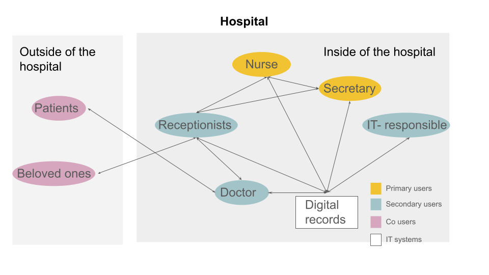

# [Locating Patients]
## Product Requirements Document

> **TRA460: Digital Health Implementation** | Chalmers University of Technology

> **v1.0 Section Guide:**
> - **[Required]** — Must be substantive for this submission to pass.
> - **[Recommended]** — Optional for v1.0, but strengthens your foundation.
> - **[Expand Later]** — Scaffolding for future iterations. Initial thoughts welcome.

---

### Project Details [Required]

| Field               | Value                                      |
|---------------------|--------------------------------------------|
| **Group**           | TRA460_Group_1                            |
| **Version**         | 1.0                                        |
| **Date**            | 2026-04-14                                |
| **Clinical Mentor** | Linda Wahlström Andersson, Ward Chief, Sahlgrenska                 |
| **Group Members**   | Abdi, Fawsi (Medical student); Alm, Emma (Industrial design engineering); Odinger, Gustav (Software engineering); Xie, Yanran (Computer Systems & Cybersecurity)     |

---

## 1. Needs Statement [Required]

<!--
  REQUIRED FOR v1.0

  THE CORE OF YOUR PRD.
  Use the Stanford Biodesign format below. Be specific:
  - The verb should describe a function, not a technology.
  - The population should be narrow enough to be actionable.
  - The outcome should be measurable or clearly observable.

  Weak:  "A way to use AI for patients that improves healthcare."
  Strong: "A way to detect early signs of atrial fibrillation
           in post-stroke patients managed in primary care
           that reduces time-to-treatment for recurrent events."
-->

A way for the nurses, caretakers and administrators who work at a neurosurgical hospital ward to plan and organize the daily work, with a focus on patient locations.

---

### 1.1 Clinical Context & Background [Required]

<!--
  REQUIRED FOR v1.0

  Set the stage. What is the clinical problem space?
  - What condition, workflow, or care gap are you addressing?
  - How significant is this problem? (incidence, prevalence, burden)
  - Why does it matter — clinically, economically, or humanly?
-->

When a patient is admitted to Linda’s ward, they usually enter through the ward’s waiting room and get prepared for their procedure. This can include X-rays, checking blood pressure, and blood samples. Depending on what kind of procedure the patient is getting different preparations are done. Some of the preparations can be done at the ward, where they are a team of nurses, medical examiners, care takers, and doctors.

However, some preparations aren’t performed at Linda’s ward and they need to send the patient away. Despite that the patient is physically at a different ward, the patient is still located at Linda’s ward digitally and economically. This causes problems when the staff forgets or has a stressful day, then leaves a patient at, or admits it to, a different ward. The patient is physically at one place but digitally they are somewhere else. 

---
### 1.2 Key Clinical Insights [Required]

<!--
  REQUIRED FOR v1.0

  THIS IS THE MOST IMPORTANT SECTION FOR v1.0.
  Synthesize what you learned from your clinical mentor meeting(s).
  - What did you observe or hear?
  - What is the current workflow / status quo?
  - Where are the friction points, inefficiencies, or risks?
  - What surprised you?

  Ground this in specifics. Quotes, scenarios, and concrete
  examples are more valuable than generalizations.
-->
- There are multiple IT systems in use:
  - Elvis primarily used for financial and administrative purposes  
  - Melior used for medical journals  
  - Orbit for operating procedures  

- Hierarchy of patient placement
  - Hospital → Ward → Room → Bed
  - In Sahlgrenska’s neurosurgical ward (avd. 10 and 23), the following types of beds exist:
    - 01–08		Non-intensive surveillance beds
    - 10–11		Intensive / post-op beds
    - IVA		General hospital ICU beds
    - NIV1–NIV5	Neuro-specific ICU beds
    - EXTR		Newly admitted, waiting
    - Op		Operation-related beds
    - PERM		The patient went home on trial – might return or not
    - UTL		Patients borrowed out to other departments (utlånad= rent out)
  - Linda highlights that, while a patient is admitted to the ward, the patients move around between the beds and sometimes into other wards, e.g. X-ray/CT, ICU. Which is also seen during the observation of the “rounds” and testing with the nurses. 
  - Generally the patient doesn’t have to leave their bed, and the bed is moved to the new room with the patient in it. But they’re not guaranteed to always stay in the same bed

- Through interviews with nurses, secretaries and the management team, the problem of keeping track of where patients are within the hospital comes up frequently. However, there are different views of the problem, depending on the role of the person:
  - **Operative staff (nurses, secretaries)**: quickly knowing where the patient is, planning bed availability, etc.
  - **Rounds person (Lovisa)**: keeping track of and quickly updating/adding patients on the go during the day, and as part of the rounds.
  - **Management team (ward manager)**: patient safety is the key concern, in order to quickly know where the patient is in case of emergencies

- In practice, staff use a shared Excel sheet，on one ty-monitor, to manually keep track of important information used in their day-to-day work:
  - date
  - patients name
  - comment
  - operation date

- Every admitted patient has a bracelet with a QR code with their personal identification number and birth date.

- While testing the prototype, the nurses explained that they have levels of how heavy the nursing is (omvårdstunga) . Currently, this information is only visible in Melior, which makes it difficult to get an overview of how nursing heavy the different patients are and plan accordingly. However, the nurses expressed a strong interest in being able to have this information easily available during planning, to be able to better distribute workload.
  - Nursing “omvårdnad” 1, 2, 3, where 1 is the lowest and 3 the highest can be named with A, B, C
  - Medical 10, 20, 30, where 10 is green, 20 is yellow, 30 is red
  - Can be combined in any way, e.g. 120 (A20), or 330 (C30) 

- Patients can decide if hospital visitors should be allowed to know that they’re there
  - The patient’s personal identification number is always visible in Melior. Unless the patient has a protected identity, their other information (such as name) will also be fully available  
  - The patient always has the possibility to hide their visits from other people, and will then be perceived as someone with a protected identity
  - The hospital informally can use a “keyword” to let only some people know that the patient is there, but this is not a formal practice

---

### 1.3 Existing Solutions & Gaps [Required]

<!--
  REQUIRED FOR v1.0

  What solutions or tools exist today for this problem?
  - Clinical tools, apps, devices, workflows
  - Why are they insufficient, inaccessible, or underused?
  - What gap remains that your project could fill?
-->

- Something that could register the patients’ location 
- There is an attempted solution being developed right now, to replace the Excel sheets and other “homemade” solutions at the wards, but from our interviews it seems like this is a “one size fits all” solution, that in reality doesn’t contain all the necessary information for the specific wards’ needs  
- Currently they have a solution for locating patients at the cardiological ward, with heart monitors  
- In somehow synchronize the software so the location is the same in all the system  
- Amni is a company that has a similar system but still missing an overview with all the beds and other 
- Cosmic is a journal software, which focuses on journal, billing, and staffing but not on the bed planning.
  -  https://www.svt.se/nyheter/granskning/ug/sju-dodsfall-kopplas-till-journalsystemet-cosmic
---

### 1.4 Success Metrics [Recommended]

<!--
  RECOMMENDED FOR v1.0

  How will you know your solution actually addresses the need?
  Think about the "that..." clause in your Needs Statement —
  how would you measure or observe that outcome?
-->
**Quickly locating patients**
- Average time from needing to find patient to finding patient should be below 30 seconds  
- 100% of their patients should be able to be found/walked to within 5 minutes (any suitable time limit), if not in the same building above 90% of the patients should be found below 15 minutes  

**Manual documentation time**
- Time spent on registering the location of patients should be below 10 minutes per hospital staff per day  
- Reduce the average time employees spend calling to find patients per person per day  

---

## 2. Stakeholders & Users

### 2.1 User(s)

<!--
   REQUIRED FOR v1.0

  Who will directly use or interact with your solution day-to-day?
  Be specific: "Cardiac nurses in outpatient clinics" not just "nurses."
-->

#### 2.1.1 Primary users 
The following roles have access to the IT-system. They are able to check where the patients are and do it frequently during the day.
- Nurses: Most frequent user, at night and weekend  
- Secretaries  & coordinators: Most frequent user, during daytime  
- Doctors: Less common user

---

#### 2.1.2 Secondary users 
As secondary users, the users that interact with the system but not in the intended way.
- Receptionists: Access to a limited view of Elvis
- IT-staff: Behind the scenes maintenance (barely)

---

#### 2.1.3 Co-users
Co-users are the users that will be affected by the system but do not have access to it. 
- Patients
- Personal visitors

<!--
  REQUIRED FOR v1.0

  Who else is affected by or has influence over this solution?
  Consider: patients, caregivers, administrators, IT departments,
  payers/insurers, regulators, clinical champions, etc.
-->

---

### 2.2 User Journey — Current State [Recommended]

<!--
  RECOMMENDED FOR v1.0

  Describe the current care pathway or experience of your primary user.
  A simple narrative walkthrough is fine, e.g.:
  "The patient wakes up, measures their..., calls the clinic to..."
-->

Coming soon… to a theater near you

---

## 3. Solution Vision [Required]

<!--
  REQUIRED FOR v1.0

  1-2 paragraphs maximum. This is your "north star," not a feature list.
  - What is the high-level concept?
  - How does it directly address the Needs Statement?
  - What does success look like from the user's perspective?

  Keep it directional. You will refine this throughout the course.
-->

Daily planning and documentation at the neurosurgical hospital ward is quick, accurate and always up to date. Hospital staff always know where their patients are when they need it, and throughout their visits.

### 3.1 Our solution
Our solution will help the nurses, caretakers, and administrators with their daily work, to plan, organize, rearrange, and transfer their patients. The solution is aimed to simply get an overview of the patients at the ward and at the same time get enough information about the patient to treat or check in on them. 

On the other hand we want the solution to be a planning tool for the nurse that goes on the rounds, to easier check and plan the patients’ visit without compromising the care. As the planning is a 24-hour work and can change every second it is important that everyone on the staff gets the same information and that it is possible to update it at any time. 

---

## 4. Requirements

### 4.1 Functional Requirements (MoSCoW) [Recommended]

<!--
  RECOMMENDED FOR v1.0

  Categorize what your MVP needs to DO.
  Each requirement should be a clear, testable capability.
  A few items per category is enough for v1.0 — this section
  will grow significantly in later iterations.
-->

**Must Have** — *Non-negotiable for a functioning MVP*
- Patient’s name (or “XXXX” if they have a protected identity) 
- Patient’s birth year (e.g. 1984)  
- Notes about the patient (allows for unlimited customization)  
- Latest location the patient visit (e.g. X-ray, NIVA, etc.)  
- The assigned room and bed (e.g. IVA:7)
- To investigate: importance of “bed placement” vs “patient location”, and how they interact.

**Should Have** — *High value, but the MVP could technically function without these*
- Upcoming scheduled operation(s) date  
- Critical information (current “OBS” column)  
- Responsible ward  

**Could Have** — *Nice-to-have if time and resources allow*
- Personal identification number (can use hash or other confidential method) 
- “Patient left behind” notifications  
- “Patient left behind” notifications (e.g. forgot to log them leaving the X-ray)
- Integration between our system and Melior/Elvis 
- Cause of admission  
- Log of recent locations / bed placements  
- Patient’s physical location (more precise location tracking)
- To investigate: is precise patient location tracking useful? Check with Linda

**Won't Have** — *Explicitly out of scope for this project*
- Unnecessary information
  - What is unnecessary information?
- Logging medical care or confidential information  
- Shared information with the reception, other wards or outside of the hospital 

### 4.2 Non-Functional Requirements & Constraints [Recommended]

<!--
  RECOMMENDED FOR v1.0

  Consider the "invisible" requirements:
  - Data privacy & security (GDPR, patient data handling)
  - Regulatory considerations (MDR, wellness vs. medical device)
  - Accessibility (WCAG, language/localization)
  - Interoperability standards (FHIR, HL7, openEHR)
  - Performance, offline capability
-->

It should be quick and simple to:
- Log or update patient location
- Retrieve patient location
- Understand how to use the solution (user-friendly)
More requirements coming soon…

---

## 5. Technical Direction [Expand Later]

<!--
  EXPAND IN LATER ITERATIONS

  Initial thoughts only. No commitments required yet.
  This section helps your future self (and your AI agent, if using
  Claude Code) understand the technical landscape you are considering.
-->

- **Platform:** [iOS / Android / Web / Cross-platform / TBD]
- **Key Integrations:** [EHR systems, wearables, sensors, APIs, etc.]
- **Candidate Tech Stack:** [SpeziVibe, Swift/Kotlin, React, etc. / TBD]
- **Infrastructure:** [Cloud provider, on-premise, hybrid / TBD]

Coming soon…

---

## 6. Open Questions & Risks [Required]

<!--
  REQUIRED FOR v1.0

  Be honest about what you don't know yet. This is a sign of
  rigorous thinking, not weakness.
  - What assumptions are you making that haven't been validated?
  - What could block or derail this project?
  - What do you need to ask your clinical mentor next?
-->

- **Importance of “bed placement” vs “patient location”, and how they interact.**
Conducting interviews and evaluating the needs  
- **Need for precise real-time tracking:**  
  Plan: Validate with mentor and users  

- **Is precise patient location tracking useful?**  
Conducting interviews and evaluating the needs 

- **Data privacy and data integrity** (The confidentiality and accessibility of patients' location data) 

---

## Changelog [Required]

| Version | Date       | Summary of Changes                                  |
|---------|------------|-----------------------------------------------------|
| 1.0     | 2026-04-16 | Initial draft after first clinical mentor meeting   |
| 2.0     | 202-05-0   | The second draft after the feedback from the mentor |